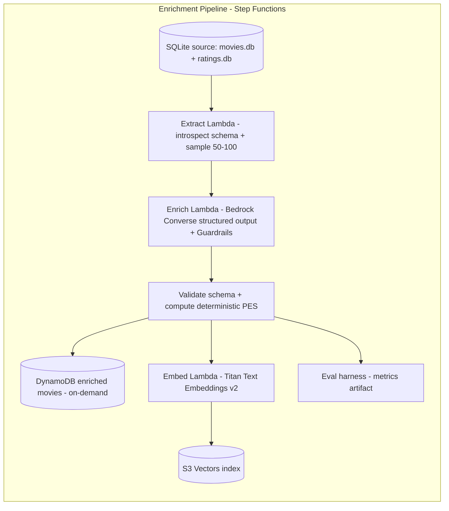
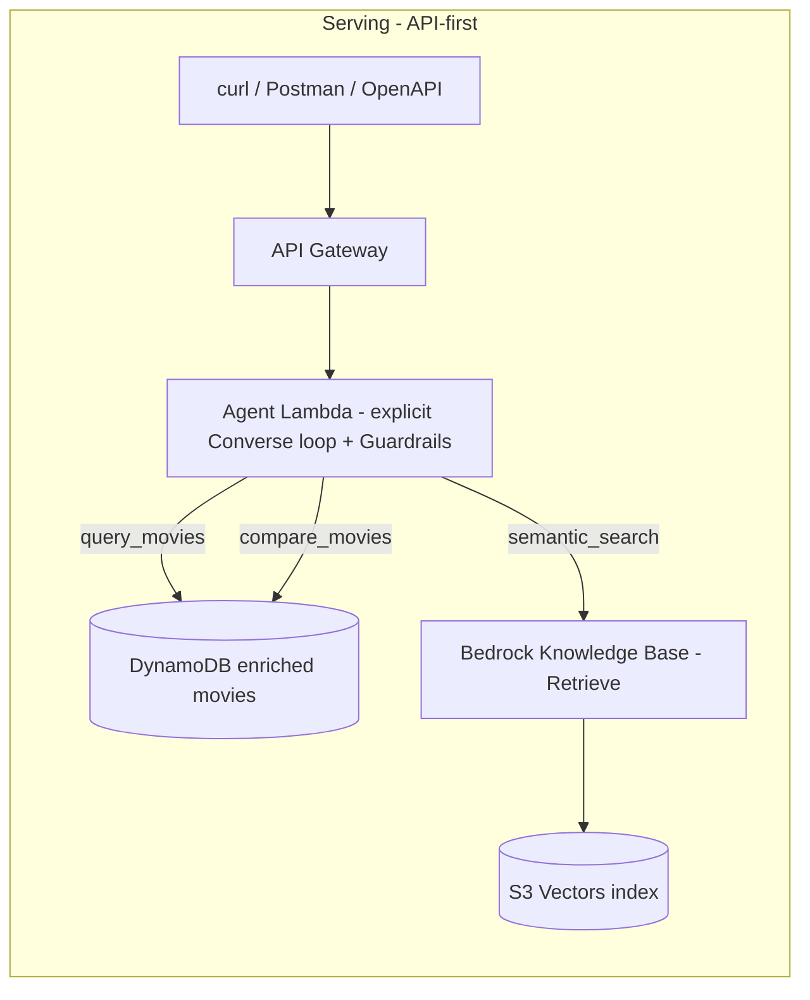

# movieintel

An LLM-integrated movie intelligence system built on Amazon Bedrock: a batch
data-enrichment pipeline (Subsystem A) and an agentic + RAG serving system
(Subsystem B), both defined in AWS CDK (Python) and both scale-to-zero.

This README is the technical brief for the project (REQ-X-7). 

## 1. Problem statement

The challenge is two-fold: (1) enrich a sample of movies with LLM-reasoned attributes and
a deterministic score, persisting the results for retrieval, and (2) serve natural-language
queries over the enriched data through an agent that can filter, compare, and semantically
search.

This repository implements both halves as cooperating subsystems on Amazon Bedrock:

- **Subsystem A — batch enrichment pipeline.** A re-runnable AWS Step Functions state
  machine samples 50-100 movies from the provided SQLite sources, enriches each with five
  attributes (overview sentiment, budget tier, revenue tier, a hybrid deterministic + LLM
  Production Effectiveness Score, and a mood/tone label), validates the structured output,
  persists to DynamoDB, embeds enriched overviews with Amazon Titan Text Embeddings V2,
  upserts the vectors into an S3 Vectors index, and emits evaluation metrics.
- **Subsystem B — agentic + RAG serving.** An HTTP API over a Lambda running an explicit
  Bedrock Converse agent loop with three tools (`query_movies`, `semantic_search`,
  `compare_movies`) plus a `final_answer` tool, returning validated structured
  recommendations, preference summaries, and comparative analyses.

## 2. Architecture

The two subsystems are coupled **only** through shared persistence: the pipeline writes
DynamoDB + S3 Vectors; the serving agent reads them (DynamoDB directly, S3 Vectors through
a Bedrock Knowledge Base). The boundary is deliberate — enrichment is batch and
cost-bursty, serving is interactive and scale-to-zero — so each subsystem is independently
deployable, testable, and demoable (design §1).

Data flow: `SQLite -> enrichment pipeline -> DynamoDB + S3 Vectors -> Knowledge Base + agent -> API`.

Real resources (all in `us-east-1`): DynamoDB table `MovieIntel` with `GSI1`; S3 Vectors
bucket `movieintel-vectors` / index `movieintel-overviews` (1024-dim); Knowledge Base
`movieintel-overviews-kb` (id `YNXUIXEYBQ`); two Guardrails -
`movieintel-enrichment-guardrail` (id `fvb8n9pc8e2q`) and `movieintel-serving-guardrail`
(id `pa4jg837hotd`); Step Functions state machine `EnrichmentPipeline`.

### 2.1 Enrichment pipeline (Subsystem A)



### 2.2 Serving layer (Subsystem B)



### 2.3 Shared-persistence coupling boundary

The only coupling between the subsystems is the shared stores. The pipeline is the sole
writer; the serving agent is a reader. The serving stack defines its own serving Guardrail
in-stack and references the shared stores by pinned literals (KB `YNXUIXEYBQ`, table
`MovieIntel`, GSI `GSI1`) because it targets already-deployed resources, so there are no
cross-stack dependencies. This keeps batch and interactive concerns separate and lets each
stack be deployed on its own cadence.

## 3. Tradeoff log

Each decision below records **what was decided, why, and what was given up**, grounded in
design §7.

### 3.1 Explicit Converse agent loop vs. managed Bedrock Agent (design §7.5)

- **Decision:** implement the agent orchestration loop in application code
  ([`agent/loop.py`](src/movieintel/agent/loop.py)), not a managed Bedrock Agent.
- **Why:** full control and testability (contract tests drive mocked multi-turn tool-use),
  transparent orchestration, and the ability to blend KB `Retrieve` with DynamoDB queries
  in the same loop.
- **Given up:** managed-Agent conveniences — hosted orchestration and built-in session
  state. We own the turn bound (`MAX_TURNS`, default `6`), tool dispatch, and error handling
  ourselves.

### 3.2 S3 Vectors vs. OpenSearch Serverless / Aurora (design §7.6, §9.1)

- **Decision:** S3 Vectors as the Knowledge Base vector store in `us-east-1`.
- **Why:** scale-to-zero vector storage with no provisioned floor; avoids the OpenSearch
  Serverless minimum (~$345+/mo) and the Aurora ACU floor, satisfying both the Knowledge
  Bases requirement and the cost goal.
- **Posture + fallback:** the S3 Vectors + Bedrock KB integration was announced in preview
  and limited to a region set (`us-east-1, us-east-2, us-west-2, eu-central-1,
  ap-southeast-2`). The design keeps a **verify-availability** posture and a documented
  **OpenSearch Serverless fallback** regardless of current GA status. In this repo the
  fallback is a *documented design posture, not an automatic switch*: the pipeline stack
  uses the native `aws_s3vectors` constructs and **fails loudly at synth** with
  `S3VectorsUnavailableError` rather than silently substituting OpenSearch (see
  [`infra/README.md`](infra/README.md)).
- **Given up:** the maturity/tooling of a GA vector database, in exchange for true
  scale-to-zero economics.

### 3.3 DynamoDB single-table modeling (design §7.3)

- **Decision:** one on-demand `MovieIntel` table with a single `GSI1` partitioned by
  sentiment and sorted by a **zero-padded PES** value (so the GSI is numeric-sortable);
  `BatchGetItem` powers compare.
- **Why:** the serving access patterns (filter/compare by budget/revenue/runtime/sentiment,
  rank by PES) are satisfied by that GSI plus batch gets, with no provisioned capacity.
- **Given up / documented tradeoff:** at 50-100 items, sentiment-agnostic numeric filtering
  uses a **documented small-N `Scan` with filter** rather than a GSI per numeric field —
  cheapest and simplest at this scale, stated openly rather than over-indexing a tiny
  dataset.

### 3.4 Structured-output strategy with bounded repair (design §7.4)

- **Decision:** request JSON via the Converse API constrained to the `EnrichmentAttributes`
  schema, validate with Pydantic, and run a bounded repair turn on failure
  ([`enrichment/client.py`](src/movieintel/enrichment/client.py), `MAX_REPAIR_ATTEMPTS`
  default `4` - raised from an initial `2` to lift the structured-output pass rate on
  long/dense overviews).
- **Why:** provider-portable, transparent, and testable with mocked Bedrock (valid /
  malformed-then-repaired / blocked paths).
- **Given up:** accepting the first output — repair adds latency and token cost. The bound
  caps it, and persistent failure degrades to a **recorded per-movie skip**
  ([`Failed`](src/movieintel/enrichment/results.py)), never a pipeline abort.

### 3.5 Implementation note — Bedrock inference-profile IAM nuance

The model id `us.anthropic.claude-sonnet-4-5-20250929-v1:0` is a **cross-region inference
profile**. Invoking it requires `bedrock:InvokeModel` on **both** the inference-profile ARN
**and** the three cross-region foundation-model ARNs it routes to. This is centralized in
[`infra/constants.py`](infra/constants.py) (`bedrock_invoke_model_resources`) and reused by
both the pipeline and serving IAM grants; see
[`docs/responsible-ai.md`](docs/responsible-ai.md) for the least-privilege audit.

## 4. Cost model

The architecture costs near-zero when idle, with cost driven almost entirely by active
work. See [`docs/cost-and-teardown.md`](docs/cost-and-teardown.md) for the full table.

- **Idle (near-zero):** on-demand DynamoDB (no provisioned floor, storage only), S3 Vectors
  storage only, scale-to-zero Lambda (no provisioned concurrency), per-request HTTP API, no
  idle Guardrail / Knowledge Base / Step Functions floor.
- **Active:** Bedrock Converse (Sonnet 4.5) tokens per enrichment movie and per agent turn
  (the dominant cost), Titan v2 embeddings per non-blank overview, and Step Functions state
  transitions per movie. DynamoDB on-demand request units accrue on enrichment writes and
  query reads.

## 5. Responsible AI

Two Guardrails, split by threat model, are each attached to **every** Converse call in
their subsystem: `movieintel-enrichment-guardrail` (id `fvb8n9pc8e2q`) on the batch
enrichment path and `movieintel-serving-guardrail` (id `pa4jg837hotd`) on the interactive
serving path. They share one content/topic/PII policy and differ only in prompt-injection
handling. The full policy, the threat-model rationale, and the least-privilege IAM audit are
in [`docs/responsible-ai.md`](docs/responsible-ai.md).

- **Fail-closed:** [`BedrockConfig.guardrail_config`](src/movieintel/config.py) raises
  `GuardrailNotConfiguredError` when no Guardrail id is set, so a missing id stops the call
  rather than sending an unguarded request.
- **Content filters:** the five harmful-content filters (`HATE`, `VIOLENCE`, `SEXUAL`,
  `INSULTS`, `MISCONDUCT`) enabled at `HIGH` on both Guardrails.
- **Prompt injection, by threat model:** `PROMPT_ATTACK` (input-only) is on the **serving**
  Guardrail, where untrusted user `/query` text can attempt injection. It is deliberately
  **absent** from the enrichment Guardrail: enrichment input is trusted (our own prompts plus
  a database overview, no user input), and a `PROMPT_ATTACK` filter there misclassified the
  enrichment prompt's own JSON-formatting instructions as injection and blocked requests.
- **PII:** `EMAIL` and `PHONE` set to `ANONYMIZE` (not block), with one denied topic
  `non-movie-advice`. `NAME` is intentionally **not** anonymized: a movie assistant must emit
  real cast/director/character names, and anonymizing them corrupted the structured output.
- **Intervention handling:** enrichment records a `Blocked` outcome and skips the item;
  serving returns a safe `RefusalResponse` at HTTP 200 — never a leaked or partial answer.
- **Status:** the two-Guardrail split and tightened IAM are defined in CDK and applied on
  `cdk deploy` / redeploy.

## 6. How to run end to end

Every command below is accurate to this repo. There is **no global `cdk` on PATH** — the
CDK CLI is invoked through `npx aws-cdk@2` from `infra/` (see
[`infra/README.md`](infra/README.md) and `infra/cdk.json`).

### Prerequisites

- [`uv`](https://docs.astral.sh/uv/).
- AWS credentials/profile.
- Bedrock model access to the Sonnet 4.5 inference profile
  `us.anthropic.claude-sonnet-4-5-20250929-v1:0` and `amazon.titan-embed-text-v2:0`.
- **Place the provided `movies.db` and `ratings.db` in `_sqlite/` at the repo root.** These
  source databases are not committed (they are the challenge-provided dataset and are large),
  so you must add them before running the local demo, the tests that read them, or a deploy.
  At deploy time `cdk synth`/`deploy` packages `_sqlite/` into a read-only Lambda layer that
  the enrichment pipeline's Extract Lambda reads at runtime; the CDK stack fails fast at synth
  (`MissingSourceDatabaseError`) if the files are absent, so a missing DB cannot silently
  produce an empty pipeline. The expected files are `_sqlite/movies.db` and
  `_sqlite/ratings.db` (exact names).

### Install

```bash
uv sync --dev
```

### Quality gate

```bash
uv run ruff check .          # lint
uv run ruff format --check . # format
uv run mypy                  # types (config covers src, tests, infra)
uv run pytest                # tests; all Bedrock/AWS mocked, live gated behind @pytest.mark.live
```

### Local demos (offline)

```bash
uv run movieintel-demo         # Task-1 data-access demo: real schemas, derived rating scale, 50-100 sample
uv run movieintel-eval-demo    # eval report table over the golden set
```

`movieintel-demo` accepts `--n`, `--seed`, `--movies`, `--ratings`. It is the **offline
data-access demo**, not a way to query the agent.

### Deploy

```bash
cd infra
npx aws-cdk@2 bootstrap                                                       # once per account/region, if needed
npx aws-cdk@2 deploy MovieIntelPipelineStack KnowledgeBaseStack MovieIntelServingStack
```

A (re)deploy applies the Task-11 Guardrail/IAM hardening to live resources.

### Enrich

Start one execution of the `EnrichmentPipeline` state machine (replace with the deployed
ARN from the stack outputs or the console):

```bash
aws stepfunctions start-execution --state-machine-arn <EnrichmentPipeline-ARN>
```

Requires Bedrock model access and the Guardrail prerequisites above. On the latest
observed run of the 100-movie high-revenue sample, 97 of 100 enrichments passed schema
validation (`schema_validation` 0.97); the per-item Catch tolerates the rest, so a run can
succeed with a few items skipped.

### Query

```bash
export API_URL="https://izizrxgasb.execute-api.us-east-1.amazonaws.com"
./docs/examples/curl.sh
```

The base URL has **no stage path** (`/prod` is not used). The API exposes two serving paths
on the same gateway, and `curl.sh` exercises both. (A `postman_collection.json` is in
[`docs/examples/`](docs/examples/) and the contract is in
[`docs/openapi.yaml`](docs/openapi.yaml).)

**Recommended path - async submit-then-poll (`POST /jobs` -> poll `GET /jobs/{id}`).** This
is the **503-free** path. `POST /jobs` validates the same `QueryRequest` body and returns a
fast `202 {job_id, status, poll_url}` well under the 30s gateway integration timeout; a
worker Lambda then runs the agent loop to completion in the background and writes real
per-phase progress and the terminal result into DynamoDB. The client polls
`GET /jobs/{id}` (a fast single read) until `status` is `succeeded` (carrying the 5-kind
`AgentResult`) or `failed`. Because the long-running loop is decoupled from the request
window, this path never hits the 30s wall:

```bash
job_id=$(curl -sS -X POST "$API_URL/jobs" -H 'content-type: application/json' \
  --data '{"query": "Recommend action movies with high revenue and positive sentiment."}' \
  | python3 -c 'import sys, json; print(json.load(sys.stdin)["job_id"])')
curl -sS "$API_URL/jobs/$job_id"   # repeat until status is succeeded or failed
```

**Synchronous path - `POST /query` (legacy fallback).** The original single request/response
route is still available and returns the serialized `AgentResult` at `200`. The Lambda scales
to zero, so the first call can cold-start, and a heavy query can still exceed the 30s gateway
timeout and return `503` (see section 8); warm calls return a structured 200 in roughly
22-23s.

The API carries a browser CORS preflight config, but direct non-browser clients (curl,
Postman) are unaffected by CORS and query both paths exactly as shown above.

#### Warm-up endpoint

```bash
curl -sS "$API_URL/health"   # -> {"status": "ok"}
```

`GET /health` short-circuits in the serving handler and returns a fast `200` **without**
invoking the agent loop, Bedrock, DynamoDB, or the Knowledge Base. It warms the real
serving Lambda container, so firing it before a real `POST /query` (for example on front
end page load) absorbs the init cold start. It does not shorten the agent loop's own run
time.

#### Web front end

A static web client is hosted on CloudFront in front of a private S3 bucket (the
`MovieIntelFrontendStack`):

```
https://d2scp65e5pkne3.cloudfront.net
```

On load it pings `GET /health` to warm the backend, then uses the async submit-then-poll
path: it submits each query to `POST /jobs` and polls `GET /jobs/{id}`, rendering the real
per-phase progress reported by the worker and then the structured `AgentResult` on the
terminal response. Because it uses the async path, the front end is not subject to the 30s
gateway wall. The API base URL it calls is set in
[`frontend/config.js`](frontend/config.js) from the `MovieIntelServingStack` `ServingApiUrl`
output.

### Destroy

```bash
cd infra
npx aws-cdk@2 destroy MovieIntelFrontendStack MovieIntelServingStack KnowledgeBaseStack MovieIntelPipelineStack
```

Destroy in reverse dependency order (frontend, then serving, then KB, then pipeline). See
[`docs/cost-and-teardown.md`](docs/cost-and-teardown.md) for the teardown checklist and
lingering-resource notes.

## 7. Prompt-engineering examples

Full examples live in
[`docs/examples/prompt-engineering.md`](docs/examples/prompt-engineering.md). All movie data
there is **illustrative** and any `/query` body is **representative**; the field names and
enums match the real Pydantic schemas exactly. Summary:

**Enrichment prompting** ([`enrichment/prompts.py`](src/movieintel/enrichment/prompts.py)) —
the system prompt pins the analyst role and the strict single-JSON-object contract; the user
message embeds the movie facts, the given deterministic PES value (which the model may not
alter), and the `EnrichmentAttributes` JSON Schema; a bounded repair turn echoes the
validation error. An illustrative `EnrichmentAttributes` object:

```json
{
  "overview_sentiment": "positive",
  "budget_tier": "medium",
  "revenue_tier": "high",
  "effectiveness": {
    "value": 78.42,
    "roi_defined": true,
    "rating_defined": true,
    "tier": "standout",
    "explanation": "Strong revenue multiple on a moderate budget plus favorable ratings."
  },
  "mood": "intense",
  "reasoning_basis": "Revenue far exceeds budget; the given PES value supports a standout tier."
}
```

**Agent prompting** ([`agent/loop.py`](src/movieintel/agent/loop.py),
[`agent/response.py`](src/movieintel/agent/response.py)) — the loop attaches the three tool
specs plus `final_answer` and the Guardrail on every turn; the model ends by calling
`final_answer` with one of three `kind`s, which the loop validates into an `AgentResult`.
The three required examples (all illustrative outputs):

- **recommendations** — input `Recommend action movies with high revenue and positive
  sentiment.` → `kind: "recommendations"` with `query_summary` + `movies[]` of
  `{movie_id, title, sentiment, pes, mood, rationale}`.
- **preferences** — input `Summarize preferences for a user based on their ratings.` →
  `kind: "preferences"` with `{subject, summary, highlights[]}`.
- **comparison** — input `Compare the two highest-PES science-fiction films.` →
  `kind: "comparison"` with `{subjects[], dimensions[], narrative}`.

The primary `recommendations` example returns real recommendations: the high-revenue-biased
~100-movie sample puts positive-sentiment Action titles (Pirates of the Caribbean, Iron Man,
Raiders of the Lost Ark, Live Free or Die Hard, Batman Begins) in the data, so the agent
answers with `kind: "recommendations"` rather than terminating `bounded`. Real `recommendations`
result from a warm smoke check (truncated to the top two movies):

```json
{
  "kind": "recommendations",
  "query_summary": "Top action movies with high revenue and positive sentiment, ranked by box office performance",
  "movies": [
    {
      "movie_id": "22",
      "title": "Pirates of the Caribbean: The Curse of the Black Pearl",
      "sentiment": "positive",
      "pes": 85.36,
      "mood": "lighthearted",
      "rationale": "Highest-grossing action film in this category with $655M revenue. Exceptional PES of 85.36 shows outstanding production efficiency, delivering a fun, adventurous experience that resonated widely with audiences."
    },
    {
      "movie_id": "85",
      "title": "Raiders of the Lost Ark",
      "sentiment": "positive",
      "pes": 92.5,
      "mood": "intense",
      "rationale": "Highest PES at 92.5, making it the most production-efficient film on this list. With only $18M budget, it earned $390M, a masterclass in adventure filmmaking that defined the genre."
    }
  ]
}
```

## 8. Known limitations and future work

- **30s integration-timeout 503 removed by the async path.** The API Gateway HTTP API
  integration timeout is hard-capped at 30s. The multi-turn agent loop runs one sequential
  Bedrock Converse round trip (plus tool calls) per turn, so wall-clock latency grows with
  the executed turn count, and on heavier queries the loop's own run time (independent of
  cold start) could exceed 30s. When a synchronous request exceeds 30s the gateway returns an
  unstructured `503 {"message":"Service Unavailable"}` while the Lambda (300s timeout) keeps
  running and completes in the background, which is why a retry often succeeds. CloudWatch
  confirmed this: successful invocations of 30.6s and 31.7s with `IntegrationLatency` maxing
  at exactly 30000ms and matching `5xx` counts. The **async submit-then-poll path (`POST
  /jobs` -> poll `GET /jobs/{id}`) removes this 503** by decoupling the agent loop from the
  request window: `POST /jobs` returns `202` well under 30s, a worker Lambda runs the loop to
  completion in the background, and the client polls a fast single read for progress and the
  terminal result. The front end and `curl.sh`/`postman_collection.json` use this path. The
  synchronous `POST /query` route remains available as a legacy fallback and can still hit the
  30s wall on heavy queries. Other mitigations considered for the synchronous path: warm
  before the demo [absorbs cold start only]; clamp `max_turns` server-side [parked on the
  `fix/serving-max-turns-clamp` branch]; a faster model (Haiku); provisioned concurrency
  [breaks scale-to-zero]; raising the gateway timeout [not viable, hard-capped].
- **Enrichment skip rate and the Guardrail-config journey.** The latest clean-slate run of
  the 100-movie high-revenue sample passes 97/100 (`schema_validation` 0.97), with ~3 items
  tolerated by the per-item Catch. Getting there surfaced two real Guardrail misconfigurations
  that are worth knowing: (1) a PII `NAME` anonymization policy was rewriting legitimate movie
  cast/director names in the model output and corrupting the JSON; and (2) a single Guardrail
  shared by both subsystems applied a `PROMPT_ATTACK` input filter to the enrichment path,
  where it misclassified the enrichment prompt's own JSON-formatting instructions as injection
  and blocked ~98/100 requests. Both were diagnosed via per-item enrichment outcome logging
  (now in place) and fixed: `NAME` removed from the PII set, and the Guardrail split by threat
  model into an enrichment Guardrail (no `PROMPT_ATTACK`, trusted batch input) and a serving
  Guardrail (`PROMPT_ATTACK` on untrusted user queries). Remaining skips are a small number of
  repair-exhausted or content-blocked items; a per-reason tally in the eval metrics artifact is
  a near-term improvement. Empty-overview movies (~2.1% of the full dataset; see
  [`docs/cost-and-teardown.md`](docs/cost-and-teardown.md)) are a tolerated embed-skip, not a
  failure.
- **Empty-overview handling.** Blank/whitespace overviews are a tolerated embed-skip rather
  than a failure.
- **Next steps.** Async serving (202 + poll) to remove the cold-start cliff; richer
  evaluation (more judges, larger golden set); more enrichment attributes; auth and
  rate-limiting on the API, and continuous deployment (see the subsections below).

### 8.1 API security and authentication (future work)

**Current posture:** `POST /query` is a public, unauthenticated HTTP API endpoint. There is
no network- or API-layer access control; prompt-injection defense exists only at the model
layer (the serving Guardrail's `PROMPT_ATTACK` input filter, §5). That is acceptable for a
demo but not for production. Concrete productionization options, with tradeoffs:

- **Cognito user pools + JWT authorizer on the HTTP API.** Native, managed sign-in and token
  issuance; the HTTP API validates the JWT with no custom code. Best fit for human/end-user
  access. Adds a user-pool to operate and a token-acquisition step to the client flow.
- **Lambda (custom) authorizer.** A small authorizer function validates API keys or opaque
  tokens and returns an allow/deny policy. Most flexible (arbitrary validation logic,
  bring-your-own identity), at the cost of owning and testing that authorizer and its latency
  on every request.
- **IAM auth (SigV4).** Callers sign requests with AWS credentials; good for
  service-to-service access inside AWS with no separate secret to distribute. Poor fit for
  browser or third-party clients.
- **CloudFront + AWS WAF in front of the API.** Managed rule groups, bot control, and
  geo/IP allow- and block-lists at the edge, plus a single TLS and caching layer. Composes
  with any of the auth options above rather than replacing them.
- **Mutual TLS, or a private API (VPC link / private API Gateway).** If the endpoint should
  not be internet-facing at all, mTLS pins trusted clients and a private API removes public
  exposure entirely. Strongest isolation; only viable when every caller is known and
  network-reachable.

Any API keys or client secrets introduced by these options would live in AWS Secrets Manager
and be resolved at runtime, never committed to code or baked into Lambda env literals,
consistent with the project's existing config approach (§3.5, `config.py`).

### 8.2 Rate limiting, throttling, and abuse protection (future work)

**Current posture:** there is no rate limiting, throttling, usage plan, or WAF on the API.
This matters more here than for a typical CRUD endpoint: every `/query` invokes Bedrock
Converse, a metered, cost-incurring, latency-heavy backend (§4), so unthrottled traffic is
both a cost-amplification and a denial-of-wallet risk, and it can trip downstream Bedrock
model throttling and account quotas. What production would add:

- **API Gateway throttling.** Account-level and per-route/stage rate and burst limits to cap
  sustained and spike traffic before it reaches the Lambda or Bedrock.
- **Usage plans + API keys.** Per-client quotas and rate limits so one caller cannot exhaust
  shared Bedrock capacity or budget for everyone else.
- **WAF rate-based rules.** IP-level abuse protection (automatic blocking above a request
  threshold), complementing the gateway's coarser limits.

This ties directly to the synchronous-latency limitation above: moving to an async pattern
(202 + poll/callback) combined with per-client quotas would address both the cost/abuse
exposure and the cold-start/latency cliff in one change.

### 8.3 CI/CD with GitHub Actions (future work)

**Current posture:** CI exists - [`.github/workflows/ci.yml`](.github/workflows/ci.yml) runs
on every push and pull request and gates on the full quality suite (`uv sync`, `ruff check`,
`ruff format --check`, `mypy`, `pytest` with Bedrock/AWS mocked). There is **no CD**: deploys
are run manually from a workstation (`npx aws-cdk@2 deploy`), and the enrichment pipeline is
triggered by hand. What production would add:

- **Continuous deployment.** A deploy workflow (on merge to the main branch, or manually
  dispatched) that runs `cdk deploy` for the three stacks, authenticating to AWS via GitHub
  OIDC + a scoped IAM role rather than long-lived access keys. A `cdk diff` on pull requests
  would surface infrastructure changes under review before merge.
- **Environment promotion.** Separate dev/staging/prod accounts or stacks with manual
  approval gates between stages, so a change is validated in a lower environment before it
  reaches the live endpoint.
- **Pipeline hardening.** Pin action versions by SHA, add dependency and container scanning,
  and run the `@pytest.mark.live` smoke tests against a disposable environment post-deploy as
  a release gate. Widen the CI `mypy` step to the full configured scope (`src`, `tests`,
  `infra`) so type checking in CI matches the local gate rather than only `src`.
- **Supply-chain and secrets.** Keep the uv lockfile authoritative in CI (`uv sync` from the
  committed lock), and source any deploy-time secrets from GitHub OIDC / Secrets Manager, never
  committed or stored as plaintext repository secrets where avoidable.

The latest observed enrichment run (100-movie high-revenue sample, clean slate) reported
eval metrics: schema-validation `0.97` (97/100), PES-exactness `1.0` (100/100), sentiment
agreement `1.0`, mood/tone agreement `1.0`, guardrail coverage `1.0`.

## 9. Project structure

```
src/movieintel/
  data_access/   # SQLite open + ratings-schema introspection + reproducible sampling (REQ-A-1)
  domain/        # pure PES formula + Pydantic enrichment schemas/enums (REQ-A-2,3; REQ-X-1)
  enrichment/    # Bedrock Converse enrichment client: structured output + bounded repair + Guardrails (REQ-A-4)
  persistence/   # DynamoDB repo + S3 Vectors writer + Titan embedder (REQ-A-5)
  eval/          # golden set + metrics harness (eval-as-tests) (REQ-X-2)
  kb/            # Bedrock Knowledge Base Retrieve client + config (REQ-B-1)
  agent/
    loop.py      # explicit Converse agent loop (REQ-B-3)
    response.py  # terminal AgentResult models + final_answer spec
    tools/        # query_movies, compare_movies, semantic_search + toolConfig specs (REQ-B-2)
  serving/       # Lambda handler + request/response schemas (REQ-B-4)
  config.py      # Bedrock region, model id, Guardrail config (fail-closed)
infra/
  app.py                   # CDK app entry (three stacks, us-east-1)
  pipeline_stack.py        # MovieIntelPipelineStack: stores, Guardrail, Lambdas, Step Functions (REQ-A-6)
  knowledge_base_stack.py  # KnowledgeBaseStack: Bedrock KB over S3 Vectors (REQ-B-1)
  serving_stack.py         # MovieIntelServingStack: HTTP API + agent Lambda (REQ-B-4)
  handlers/                # thin Lambda wrappers over the movieintel package
  constants.py             # shared bundling + inference-profile IAM helpers
docs/            # openapi.yaml, examples/, responsible-ai.md, cost-and-teardown.md
```
