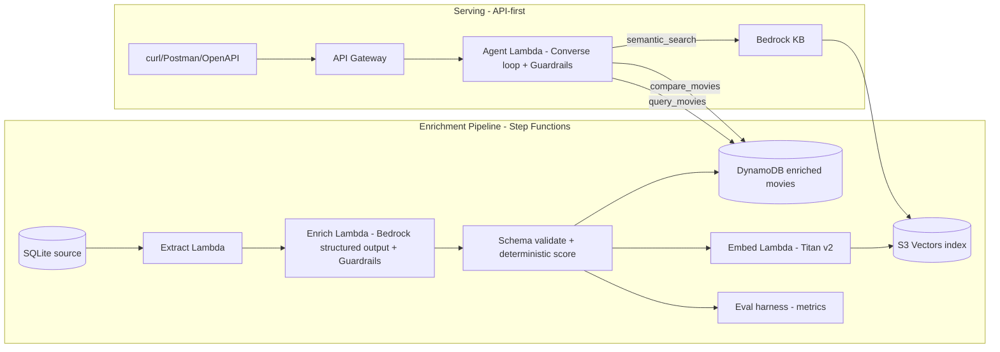

# Implementation Plan - LLM-Integrated Movie Intelligence System (Aetna/CVS Principal GenAI Submission)

## Problem Statement

Deliver a response to the Aetna "Movie Systems Design" challenge that reads as principal-level work: an LLM-integrated movie system with (1) a reproducible data-enrichment pipeline that adds 5 attributes to a sample of movies, and (2) an agentic recommendation/analysis system built on Amazon Bedrock. It must be fully operational in the user's AWS account, teardown-friendly via IaC, and defensible in a live code review by staff engineers. Success is measured less by feature count than by clarity of design, deliberate tradeoffs, testability, and alignment with the job description (Bedrock Foundation Models, Knowledge Bases, Agents, Converse API, Guardrails, RAG, Python, serverless, responsible AI).

## Requirements (gathered)

- Audience: both a polished repo for live review AND a live, reachable AWS deployment.
- Stack: Python, lean serverless (API Gateway + Lambda), no Amplify. Static UI deprioritized - API-first with OpenAPI docs + curl/Postman examples.
- LLM backbone: Amazon Bedrock throughout (Converse API with tool calling for the agent; Knowledge Bases for RAG; Guardrails for responsible AI).
- Runtime data: DynamoDB (on-demand) for enriched movies; S3 Vectors as the vector store wired into a Bedrock Knowledge Base for RAG.
- System centerpiece: full agentic + RAG - a Converse-API tool-calling agent (DB query + comparison tools) over the enriched data, plus KB retrieval over enriched overviews.
- Enrichment: Step Functions-orchestrated, re-runnable pipeline producing 5 attributes.
- Enrichment attributes include a hybrid Production Effectiveness Score (deterministic formula + LLM explanation/tier).
- Evaluation: structured eval harness (golden set, schema validation, LLM-as-judge, deterministic checks) + Guardrails + strict structured-output enforcement, framed as responsible AI.
- Testing: unit + integration + contract tests for agent/tools + eval-as-tests; Bedrock mocked in CI.
- Cost: everything scale-to-zero / teardown-friendly; deploy for the interview window and destroy after.

## Background / Research Findings

- **S3 Vectors + Bedrock Knowledge Bases**: Verified via AWS docs and the launch blog. S3 Vectors is a native vector store option for Bedrock Knowledge Bases - you select an S3 vector bucket + index as the KB's vector store. It provides scale-to-zero, no-provisioned-infra vector storage (subsecond queries, ~100ms for frequent), up to ~tens of millions of vectors per index, with metadata filtering. This satisfies both the JD "Knowledge Bases" keyword and the scale-to-zero cost goal, and avoids the OpenSearch Serverless minimum (~$345+/mo) and Aurora ACU floor.
  - **Caveat to verify at build time**: at announcement, S3 Vectors + Bedrock KB integration was in **preview** in us-east-1, us-east-2, us-west-2, eu-central-1, ap-southeast-2. Design will target one of these regions and include a documented **OpenSearch Serverless fallback** path in case of GA/region/preview constraints. This "verify availability, keep a fallback" note is itself a principal-level signal.
- **Bedrock Converse API**: Unified `Converse`/`ConverseStream` with `toolConfig` (tool specs as JSON schema). Model returns `stopReason: "tool_use"`; app executes the tool and returns a `toolResult` content block in the next turn. This is the clean, provider-portable way to build the agent loop in Python (boto3 `bedrock-runtime`). We'll implement an explicit agent orchestration loop rather than a managed Bedrock Agent, for testability and live-defensibility (and document the managed-Agent alternative with tradeoffs).
- **Bedrock Knowledge Bases retrieval**: `bedrock-agent-runtime` exposes `Retrieve` (raw chunks) and `RetrieveAndGenerate` (RAG answer). We'll use `Retrieve` as a *tool* the agent can call, keeping the orchestration in our code - more transparent for review and lets us blend KB retrieval with DynamoDB structured queries.
- **Guardrails**: Bedrock Guardrails can be attached to Converse calls (`guardrailConfig`) for content filtering, denied topics, and PII handling - our responsible-AI story.
- **Embeddings**: Amazon Titan Text Embeddings V2 (`amazon.titan-embed-text-v2:0`) for enriched-overview vectors.
- **Data**: Source is two SQLite DBs (`movies.db`, `ratings.db`) under `AetnaCodeChallenge-AIEngineers/_docs/original_instructions/db/`. `movies` schema is documented (movieid, title, imdbid, overview, productioncompanies, releasedate, budget, revenue, runtime, language, genres, status). `ratings` schema is NOT documented in the README - the pipeline's first step must introspect the actual SQLite schema before relying on column names (the binary DBs were not read during planning; the ratings columns are an assumption to verify in code).

## Proposed Solution

Two cooperating subsystems, both on Bedrock, both IaC-managed and scale-to-zero.

1. **Enrichment pipeline (batch, re-runnable)** — Step Functions orchestrates: extract sample from SQLite → for each movie, call Bedrock (structured JSON output, Guardrails on) to produce 5 attributes → validate against JSON schema → compute deterministic Production Effectiveness Score + LLM tier/explanation → write enriched records to DynamoDB → generate Titan embeddings of enriched overviews → upsert into S3 Vectors index. An eval stage runs the golden-set harness and emits metrics.

2. **Serving system (agentic + RAG)** — API Gateway → Python Lambda running an explicit Converse-API agent loop with three tools: `query_movies` (structured DynamoDB/filter queries for comparisons by budget/revenue/runtime/sentiment), `semantic_search` (Bedrock KB `Retrieve` over S3 Vectors), and `compare_movies` (deterministic comparative analysis). Guardrails attached. Returns structured recommendations / preference summaries / comparative analyses. OpenAPI spec + curl/Postman collection for the live demo.

## Repo & tooling conventions

- Python 3.12, `uv` or `poetry` for deps, `ruff` + `mypy`, `pytest`. boto3 for AWS/Bedrock.
- IaC: **AWS CDK (Python)** - keeps one language across app + infra, strong for live review and clean `deploy`/`destroy`.
- `moto`/stubs to mock Bedrock, DynamoDB, S3 Vectors in CI; eval-as-tests gated behind a marker so CI stays deterministic and free.
- README structured as a technical brief: problem, architecture, tradeoffs, cost model, responsible-AI, how-to-run, teardown, "what I'd do next."

## Task Breakdown

Tasks are TDD-oriented, each a working, demoable increment, each building on the prior with no orphaned code.

- [ ] **Task 1: Repo scaffold, tooling, and data access layer.** Set up the Python project (deps, ruff/mypy/pytest, CI config), and a `data_access` module that opens the SQLite DBs and **introspects actual schemas** (including the undocumented `ratings` table) exposing typed read functions. Tests: schema-introspection and sampling against the real DBs. *Demo: run a command that prints the real movies/ratings schemas and a 50-100 movie sample with join to ratings.*

- [ ] **Task 2: Enrichment domain logic (pure, Bedrock-free).** Implement the deterministic Production Effectiveness Score (ROI + normalized rating, documented formula) and the Pydantic JSON schemas for all 5 attributes (sentiment, budget tier, revenue tier, effectiveness score+tier, plus one more e.g. audience/theme tags). Tests: deterministic score cases, schema validation accept/reject. *Demo: compute scores and validate sample enrichment records entirely offline.*

- [ ] **Task 3: Bedrock enrichment client with structured output + Guardrails.** Implement a Bedrock Converse wrapper that produces schema-valid JSON for the LLM-reasoned attributes (sentiment, tier labels, effectiveness explanation), with retry/repair on invalid JSON and an attached Guardrail. Tests: unit with mocked Bedrock (valid, malformed-then-repaired, guardrail-blocked). *Demo: enrich a single movie end-to-end against real Bedrock, showing a validated JSON record.*

- [ ] **Task 4: Evaluation harness (eval-as-tests).** Build a golden set (hand-labeled subset) and automated checks: schema validation rate, deterministic-score exactness, LLM-as-judge for sentiment agreement, Guardrail-coverage check. Emit a metrics report. Tests: harness runs on fixtures deterministically in CI; live-eval behind a marker. *Demo: produce an evaluation report table (accuracy/agreement/validation metrics) over the golden set.*

- [ ] **Task 5: DynamoDB + S3 Vectors persistence.** Define the DynamoDB single-table design for enriched movies (access patterns for filter/compare queries) and the S3 Vectors index; implement write/upsert and Titan-v2 embedding generation. Tests: persistence with moto/mocked S3 Vectors; round-trip read. *Demo: load enriched sample into DynamoDB and vectors into S3 Vectors; query both directly.*

- [ ] **Task 6: Step Functions enrichment pipeline wired in CDK.** Compose Tasks 1-5 into a Step Functions state machine (extract → enrich → validate+score → persist → embed → eval), deployed via CDK. Tests: Lambda handler units + a local state-machine definition test. *Demo: `cdk deploy`, trigger the pipeline, watch it populate DynamoDB + S3 Vectors and emit eval metrics.*

- [ ] **Task 7: Bedrock Knowledge Base over S3 Vectors.** Create the KB bound to the S3 Vectors index via CDK (with documented OpenSearch Serverless fallback and region/preview note); implement a thin `semantic_search` client over the KB `Retrieve` API. Tests: client unit with mocked `bedrock-agent-runtime`. *Demo: natural-language query returns relevant enriched movies via KB retrieval.*

- [ ] **Task 8: Agent tools (query_movies, compare_movies, semantic_search).** Implement the three tools as pure, individually testable functions plus their Converse `toolConfig` JSON-schema specs. Tests: unit tests for each tool incl. comparative-analysis correctness; contract tests asserting tool specs match handler signatures. *Demo: invoke each tool directly with sample inputs and show structured results.*

- [ ] **Task 9: Converse-API agent orchestration loop.** Implement the explicit agent loop (send → handle `tool_use` → execute tool → return `toolResult` → repeat), with Guardrails attached, max-turn/safety limits, and structured final output (recommendations / preference summary / comparative analysis). Tests: contract tests driving a mocked Bedrock through multi-turn tool-use sequences; guardrail-blocked path. *Demo: run the agent locally on prompts like "Recommend action movies with high revenue and positive sentiment" and "Summarize preferences for a user from their ratings."*

- [ ] **Task 10: API Gateway + Lambda serving layer with OpenAPI.** Expose the agent behind API Gateway via CDK, publish an OpenAPI spec, and ship a curl/Postman collection. Tests: handler integration tests (mocked Bedrock), request/response schema validation. *Demo: `cdk deploy`, then hit the live endpoint with the provided curl examples and get structured responses.*

- [ ] **Task 11: Responsible-AI, cost, and teardown hardening.** Finalize Guardrails config, least-privilege IAM, PII handling notes, a documented cost model (idle vs. active), and verified `cdk destroy` teardown. Tests: IAM/policy assertions where feasible; a teardown dry-run checklist. *Demo: show near-zero idle cost, run `cdk destroy`, confirm all resources removed.*

- [ ] **Task 12: Technical-brief README and prompt-engineering showcase.** Write the README as a principal-level brief: architecture + mermaid diagram, tradeoff log (explicit agent loop vs. managed Agent, S3 Vectors vs. OpenSearch/Aurora, DynamoDB modeling, structured-output strategy), prompt-engineering examples with varied inputs, eval results, cost model, responsible-AI section, and "future work." *Demo: a reviewer can read the README and run the whole system (deploy, enrich, query, destroy) from it.*

## Key tradeoffs flagged for live review

- S3 Vectors + Bedrock KB preview/region constraint, with a documented OpenSearch Serverless fallback.
- The undocumented `ratings` schema is introspected in code before use rather than assumed.
- Explicit Converse-API agent loop chosen over a managed Bedrock Agent for testability and transparency.
